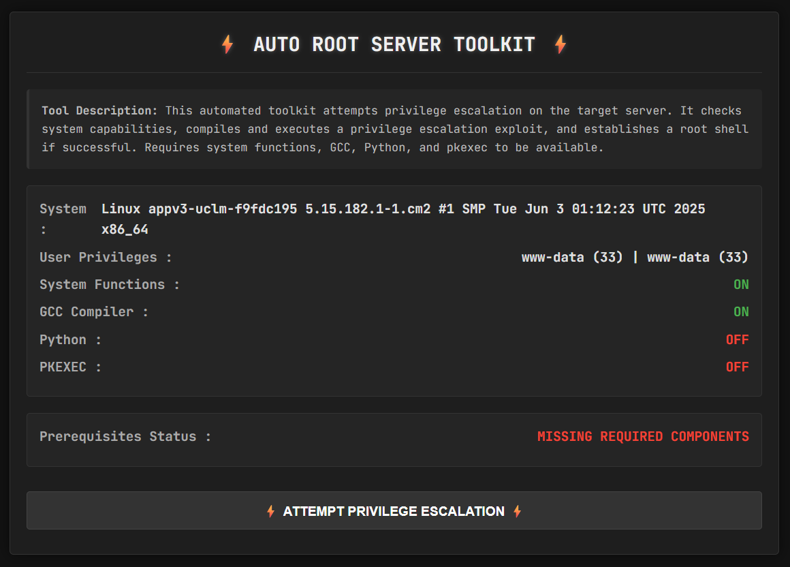
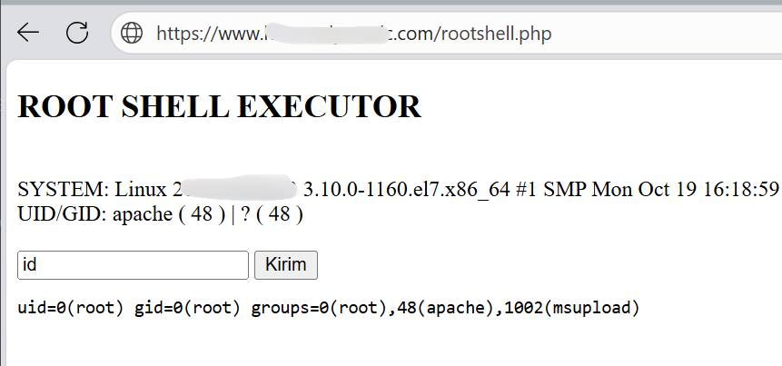

 

# Auto Root Server Toolkit

A sophisticated privilege escalation toolkit designed to automate the process of gaining root access on vulnerable servers. This tool checks system capabilities and attempts various escalation techniques.

## Features

- System capability assessment (GCC, Python, pkexec)
- Automated privilege escalation attempt
- Root shell establishment if successful
- Clean, intuitive interface with status monitoring
- Dark theme for comfortable usage

## Requirements

- Web server with PHP support
- Basic system utilities (GCC, Python)
- Vulnerable system configuration (pkexec vulnerability)

## Installation

1. Upload the `index.php` file to your target server
2. Ensure the web directory has write permissions
3. Access the file through a web browser

```bash
wget https://raw.githubusercontent.com/JawaTengahXploit1337/Auto-Root-Server/main/root.php
```

## Usage

1. Access the tool through your web browser
2. Review system status indicators (all must be green)
3. Click "Attempt Privilege Escalation" button
4. If successful, click the provided link to access root shell

 

*(Work Root Shell Command)*

## Technical Details

The toolkit works by:
1. Checking system capabilities
2. Compiling and executing a privilege escalation exploit
3. Establishing a root shell if vulnerabilities exist

## Warning

⚠️ **This tool is for educational and authorized penetration testing purposes only**  
⚠️ Unauthorized use against systems you don't own is illegal  
⚠️ Use responsibly and only with proper permissions

## Legal Disclaimer

The developer assumes no liability and is not responsible for any misuse or damage caused by this program. Use this tool only on systems you have explicit permission to test.

## Contributing

Pull requests are welcome. For major changes, please open an issue first to discuss what you would like to change.

## License

[MIT](https://choosealicense.com/licenses/mit/)
```

### Recommended additions for your repository:

1. Create a `preview.png` showing your tool's interface
2. Add a `demo.gif` showing the tool in action
3. Include a `LICENSE` file (MIT recommended)
4. Add a `.gitignore` file for PHP

The README provides:
- Clear installation/usage instructions
- Visual aids (placeholders for images)
- Important legal warnings
- Professional structure that encourages responsible use

You can customize the "[yourusername/auto-root-toolkit]" parts with your actual GitHub username and repository name.
```
